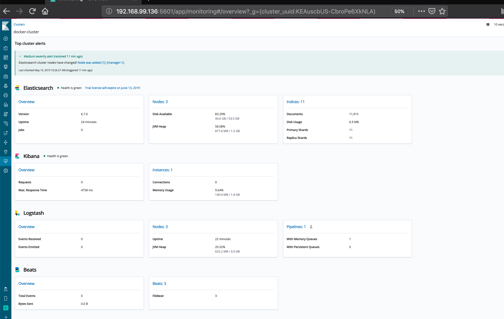

# elastic-stack-swarm


[](https://travis-ci.org/nsherron90/elastic-stack-swarm)

## Getting Started

These instructions will create a docker swarm instance running Elasticsearch, Kibana, Logstash and Filebeats 
using docker-machine with the default virutalbox driver.

### Prerequisites

Virutalbox and docker-machine need to be installed locally

```bash
$ docker-machine -v
docker-machine version 0.16.1, build cce350d7
```

```bash
$ which virtualbox
/usr/local/bin/virtualbox
```

### Installing

Clone this repo locally

```
$ git clone https://github.com/nsherron90/elasticstack-swarm.git
```
Cd into the clone directory

```
$ cd elasticstack-swarm
```

Use the machine.sh script to run default variables found in .env

```
$ cat .env 

ELK_VERSION=6.7.0
ELASTICSEARCH_USERNAME=elastic
ELASTICSEARCH_PASSWORD=changeme

...

## Set number of workers a managers
MANAGER=1                          # Default is 1
WORKER=2                           # Default is 2
MACHINE=virtualbox                 # Default is Virtualbox

```

```
$ ./machine.sh init

```

Verify successful docker-machine setup

```
$ docker-machine ls
NAME        ACTIVE   DRIVER       STATE     URL                         SWARM   DOCKER     ERRORS
manager-1   -        virtualbox   Running   tcp://192.168.99.136:2376           v18.09.6   
worker-1    -        virtualbox   Running   tcp://192.168.99.137:2376           v18.09.6   
worker-2    -        virtualbox   Running   tcp://192.168.99.138:2376           v18.09.6   

```

Verify docker swarm is running on the nodes

```
$ eval $(docker-machine env manager-1)
$ docker node ls
ID                            HOSTNAME            STATUS              AVAILABILITY        MANAGER STATUS      ENGINE VERSION
xme9zhy2lurpjgbbq2ey4z5hp *   manager-1           Ready               Active              Leader              18.09.6
kxvigwelrqrcgcygujrqe8xr1     worker-1            Ready               Active                                  18.09.6
d0wf2w2jktuae1kvahihvkbhz     worker-2            Ready               Active                                  18.09.6
```

Verify services are running

```
$ docker service ls
ID                  NAME                    MODE                REPLICAS            IMAGE                                                 PORTS
ub28ea38de5m        elastic_elasticsearch   global              3/3                 docker.elastic.co/elasticsearch/elasticsearch:6.7.0   
slnpk8juo00y        elastic_filebeat        global              3/3                 docker.elastic.co/beats/filebeat:6.6.1                
ieih1kt7wg6c        elastic_kibana          replicated          1/1                 docker.elastic.co/kibana/kibana:6.7.0                 *:5601->5601/tcp
u4w8fml5227r        elastic_logstash        global              3/3                 docker.elastic.co/logstash/logstash:6.7.0             

``` 
It may take a while (5-10min) for the services to be up and running. 

You can check for state and error info by running 
```
$ docker stack ps elastic
```

Verify elasticsearch is up and running and nodes have joined cluster

```
$  curl -u "elastic:changeme" "$(docker-machine ip manager-1):9200/_cluster/health?pretty"
{
  "cluster_name" : "docker-cluster",
  "status" : "yellow",
  "timed_out" : false,
  "number_of_nodes" : 3,
  "number_of_data_nodes" : 3,
  "active_primary_shards" : 10,
  "active_shards" : 20,
  "relocating_shards" : 0,
  "initializing_shards" : 1,
  "unassigned_shards" : 1,
  "delayed_unassigned_shards" : 0,
  "number_of_pending_tasks" : 0,
  "number_of_in_flight_fetch" : 0,
  "task_max_waiting_in_queue_millis" : 0,
  "active_shards_percent_as_number" : 90.9090909090909
}

```

### Accessing Kibana

Run `echo "http://$(docker-machine ip manager-1):5601"` to find the url for kibana.

Go to the url in your browser and sign in to Kibana.
The username is `elastic` and password is `changme`

If you click on the Monitoring tab your page should look something like this ..




### Testing Logstash

Logstash listens for beats (suricata/auth.log) input and
tcp port 5000 which pattern matches input for IP addresses and queries the [greynoise.io](https://greynoise.io) api
using the [Logstash-filter-greynoise](https://github.com/nsherron90/logstash-filter-greynoise) plugin .

```
$ echo '198.20.69.74' | nc $(dm ip manager-1) 5000
```

Then check elasticsearch for output

```
$ curl -u "elastic:changeme" "$(docker-machine ip manager-1):9200/_search?q=ip:198.20.69.74&pretty"
```
## Testing filebeat

## Deploying Suricata


## machine.sh usage

```
$ ./machine.sh --help

Script that uses docker-machine to create and manage docker-swarm cluster running elastic stack.

IMPORTANT: environment variables are read via .env file located within this directory.


Usage: ./machine.sh COMMAND

Commands:
   dm-init                  Create docker machines named manager-1 , worker-1, worker-2 etc.
                            Machine driver (aws, virtualbox(default), gce) and quantity are
                            read from .env file or environment variables.

   dm-destroy               Destroys machines created by dm-init.

   dm-restart               Runs dm-destroy then dm-init

   swarm-init               Initializes swarm on machines created by dm-init.
                            Machines named manager-[n]  and worker-[n] are created as swarm managers and workers.

   swarm-destroy            Destroys the swarm-created by swarm-init.

   swarm-ls                 Runs docker node ls on the manager-1 node to list the swarm.

   stack-init               Runs `docker stack deploy -c elastic-stack.yml elastic`
                            as swarm manager, deploying elastic-stack.yml as a swarm stack.

   stack-destroy            Destroys stack created by stack-init

   stack-restart            Runs stack-destroy followed by stack-init

```

## TODO
- [ ] Add features list
- [ ] Add Greynoise description
- [ ] Add instructions for EC2 and GCE
- [ ] Add instructions for Suricata
- [ ] Add instructions for Filebeat
- [ ] Add wiki page for architecture overview
- [ ] Add oss branch
